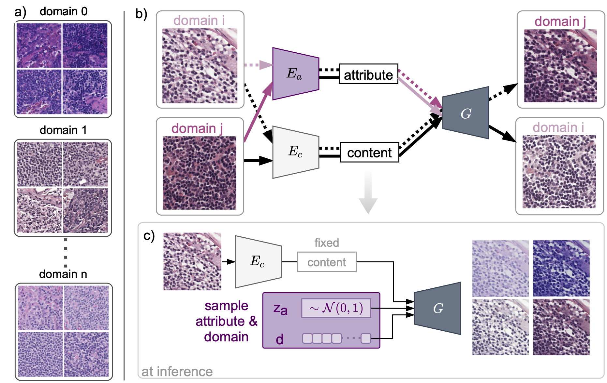

# HistAuGAN

GAN-based augmentation technique for histopathological images presented in the paper "Structure-Preserving Multi-Domain Stain Color Augmentation using Style-Transfer with Disentangled Representations" [[arxiv]](https://arxiv.org/abs/2107.12357) accepted at MICCAI 2021.

The model (GAN network of MDMM [1]) is trained on the Camelyon17 dataset [2] with 5 different medical domains (see Fig. 1a). Two seperate encoder disentangle attribute and content of the input image. Therefore, histology patches can be mapped from one medical domain to another medical domain while preserving their histological structure (see Fig. 1b). We apply this as an augmentation technique during the training of a downstream task. This makes the resulting model robust to stain variations in the histology images. In particular, it outperforms standard HSV augmentation, which was proven to be more effective than stain color normalization methods [3]. Figure 1c demonstrates how HistAuGAN is used to synthesize new histology images while keeping the conent encoding fixed. 


*Figure 1. Model overview* 

## Demo

For a demo of the augmentation technique HistAuGAN, check out the the notebook `HistAuGAN.ipynb`, which can be run in google colab. We demonstrate the image synthesis on diverse images from each of the five domains of the Camelyon17 dataset.

## Prerequisites
* Python 3.7 or higher
* PyTorch 1.7.1 or higher
* torchvision 0.8.2 or higher

You can create a minimal virtual environment with the file `requirements.txt`. For example with conda by running the following lines.
``` bash
conda create -n <env-name>
conda activate <env-name>
conda install pip
pip install -r requirements.txt
```

## Application

Our final model weights, trained on patches from the five domains of the Camelyon17 dataset can be downloaded [here](https://drive.google.com/file/d/1uObebkPgx_q6cZznGaUps-RfoSrUhNnD/view?usp=sharing).

To apply the augmentation technique in your downstream task, copy the folder `histaugan` and the model weights `gan_weights.pth` into your project folder and initialize the model in your networks initialization pass (see `model.py`, line 59ff). Then, you can add the following code to the forward pass in your network. 
``` python
# ----------------------
# HistAuGAN augmentation
# ----------------------
bs, _, _, _ = x.shape

indices = torch.randint(2, (bs, ))  # augmentations are applied with probability 0.5
num_aug = indices.sum()

if num_aug > 0:
    # sample new domain
    new_domains = torch.randint(5, (num_aug, )).to(self.device)
    domain = torch.eye(5)[new_domains].to(self.device)

    # sample attribute vector
    z_attr = (torch.randn(
        (num_aug, 8, )) * self.std_domains[new_domains] + self.mean_domains[new_domains]).to(self.device)

    # compute content encoding
    z_content = self.enc(x[indices.bool()])

    # generate augmentations
    x_aug = self.gen(z_content, z_attr, domain).detach()  # in range [-1, 1]

    x[indices.bool()] = x_aug
# ----------------------
```

## Train HistAuGAN

You can retrain the model on your dataset with the following line.
```shell
python histaugan/train.py --dataroot <path/to/your/data> --name <log-name> --num_domains <int> --batch_size <batch_size>
```
Your data should be stored in `<path/to/your/data>` in folders `trainA`, `trainB`, and so on, depending on the number of
domains. Alternatively, you can store the paths to the images in txt-files names accordingly, i.e., `trainA.txt`, 
`trainB.txt`, and so on.


## Cite

Please cite our work if you find it uesful to your research.

```
@inproceedings{HistAuGAN,
  author = {Wagner, S. J., Khalili, N., Sharma, R., Boxberg, M., Marr, C., de Back, W., Peng, T.},
  booktitle = {Medical Image Computing and Computer Assisted Intervention – MICCAI 2021},
  title = {Structure-Preserving Multi-Domain Stain Color Augmentation using Style-Transfer with Disentangled Representations},
  year = {2021}
}
```

## References

[1] Implementation https://github.com/HsinYingLee/MDMM and paper https://arxiv.org/abs/1905.01270. 
Lee, H.Y., Tseng, H.Y., Mao, Q., Huang, J.B., Lu, Y.D., Singh, M., Yang, M.H.: DRIT : Diverse Image-to-Image translation via disentangled representations (2020)

[2] Bandi, P., Geessink, O., Manson, Q., Van Dijk, M., Balkenhol, M., Hermsen, M., Ehteshami Bejnordi, B., Lee, B., Paeng, K., Zhong, A., Li, Q., Zanjani, F.G., Zinger, S., Fukuta, K., Komura, D., Ovtcharov, V., Cheng, S., Zeng, S., Thagaard, J., Dahl, A.B., Lin, H., Chen, H., Jacobsson, L., Hedlund, M., Cetin, M., Halici, E., Jackson, H., Chen, R., Both, F., Franke, J., Kusters-Vandevelde, H., Vreuls, W., Bult, P., van Ginneken, B., van der Laak, J., Litjens, G.: From detection of individual metastases to classification of lymph node status at the patient level: The CAMELYON17 challenge. IEEE Trans. Med. Imaging 38(2), 550–560 (Feb 2019). https://camelyon17.grand-challenge.org 

[3] Tellez, D., Litjens, G., Ba ́ndi, P., Bulten, W., Bokhorst, J.M., Ciompi, F., van der Laak, J.: Quantifying the effects of data augmentation and stain color normaliza- tion in convolutional neural networks for computational pathology. Med. Image Anal. 58, 101544 (Dec 2019)